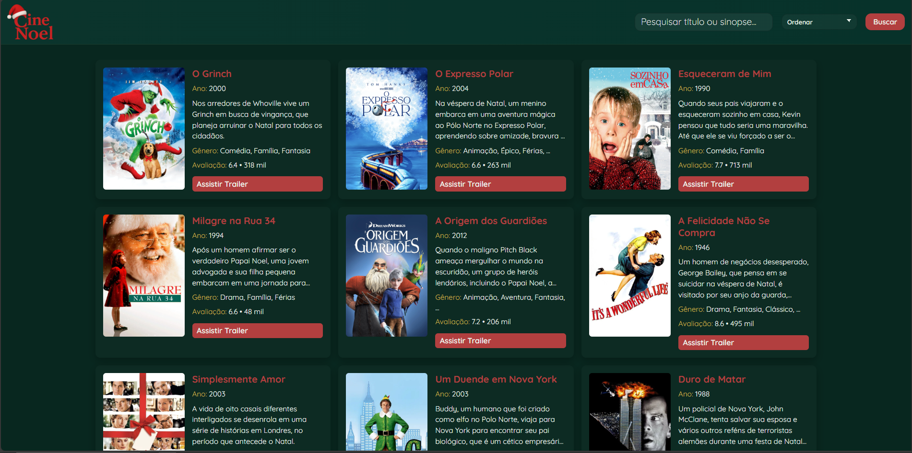

# CineNoel — Catálogo Natalino

Projeto estático (HTML/CSS/JS) que exibe um catálogo de filmes festivos a partir de `data.json`.

Resumo rápido:
- Abra `index.html` ou sirva o diretório local com um servidor HTTP.
- Busque, ordene e navegue pelos filmes; capas ausentes mostram um placeholder.

Como rodar localmente (PowerShell):

```powershell
# a partir da raiz do projeto
python -m http.server 8000; # abrir http://localhost:8000
```

Arquivos principais:
- `index.html` — página
- `style.css` — estilos
- `script.js` — lógica de carregamento/ordenacao/render
- `data.json` — dados dos filmes

Status:
- Frontend pronto. `data.json` ainda precisa ser enriquecido com URLs de `capa` e `trailer` (pendente), alguns filmes ficaram sem capa e/ou com trailer sem link.

